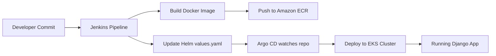

# DevOps_CI_CD Terraform Project

## Опис проєкту
Цей проєкт реалізує повний CI/CD-конвеєр із використанням **Terraform, Helm, Jenkins, Argo CD та Amazon ECR** для автоматизації розгортання Django-застосунку в Kubernetes-кластері.

### Основні можливості
- **Terraform** — створення інфраструктури (VPC, EKS, S3, DynamoDB, ECR).
- **Helm** — встановлення Jenkins та Argo CD, а також деплой Django-застосунку.
- **Jenkins** — CI-процес (збірка Docker-образу, пуш у ECR, оновлення Helm chart).
- **Argo CD** — CD-процес (GitOps, автоматичне розгортання застосунку після оновлення Git).

---

## Структура проєкту

```
│
├── main.tf # Підключення модулів
├── backend.tf # Конфігурація бекенду (S3 + DynamoDB)
├── outputs.tf # Глобальні вихідні значення
│
├── modules/ # Каталог з модулями
│ ├── s3-backend/ # Модуль для S3 та DynamoDB
│ ├── vpc/ # Модуль для VPC
│ ├── ecr/ # Модуль для Amazon ECR
│ ├── eks/ # Модуль для Kubernetes-кластеру (EKS)
│ ├── jenkins/ # Модуль для Jenkins (Helm release)
│ └── argo_cd/ # Модуль для Argo CD (Helm release + Applications)
│
├── charts/
│ └── django-app/ # Helm-чарт Django-застосунку
│ ├── templates/ # Deployment, Service, ConfigMap, HPA
│ ├── Chart.yaml
│ └── values.yaml
```

---

## Кроки використання

### 1. Підготовка інфраструктури
```sh
terraform init      # Ініціалізація Terraform та бекенду
terraform plan      # Перевірка плану змін
terraform apply     # Створення інфраструктури
```
### 2. Доступ до Jenkins
* Знайдіть URL та пароль адміністратора у terraform outputs.
* Залогіньтесь у Jenkins UI.
* Налаштуйте Jenkins pipeline (файл Jenkinsfile у репозиторії).

### 3. Запуск Jenkins pipeline
* Jenkins виконує наступні кроки:
* Збирає Docker-образ Django-застосунку.
* Публікує його в Amazon ECR.
* Оновлює тег у values.yaml Helm-чарта.
* Пушить зміни в GitHub.
### 4. Перевірка розгортання в Argo CD
* Перейдіть у UI Argo CD (hostname виводиться у terraform outputs).
* Авторизуйтесь (пароль також у terraform outputs).
* Знайдіть Application django-app.
* Переконайтесь, що застосунок автоматично синхронізувався з оновленим Helm-чартом.

## Корисні команди

### Terraform
```sh
terraform init      # Ініціалізація Terraform та бекенду
terraform plan      # Перевірка плану змін
terraform apply     # Застосування змін
terraform destroy   # Видалення всіх ресурсів
```

### Jenkins
Запуск pipeline — через веб-інтерфейс Jenkins.
Логи виконання можна перевірити у відповідній job.

### Argo CD
```sh
kubectl get pods -n argocd
kubectl get applications -n argocd
```

## Схема CI/CD

